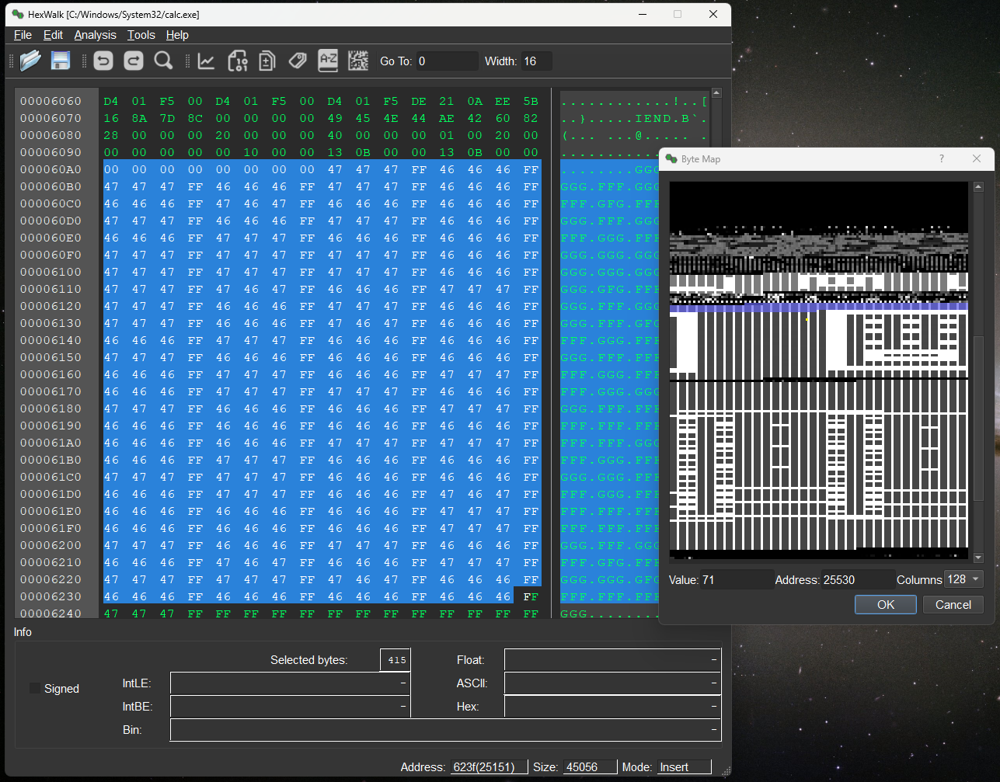
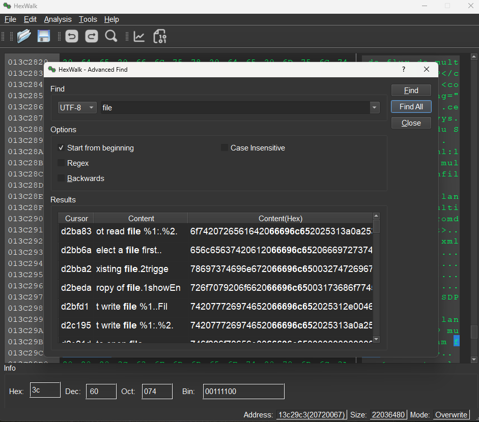
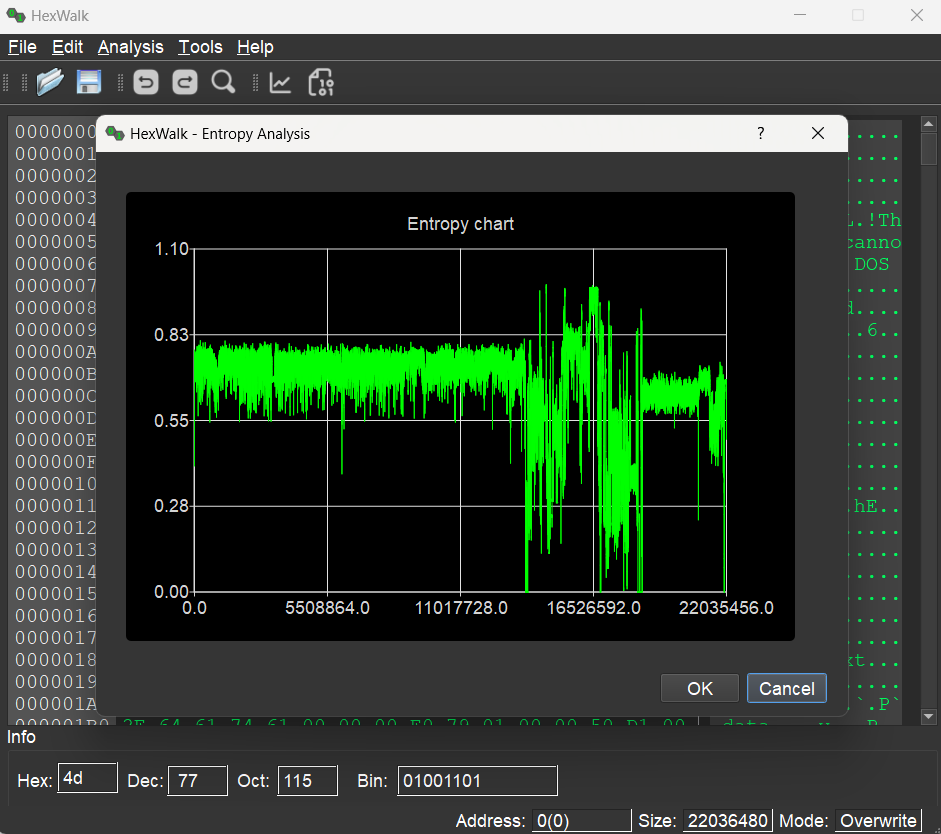
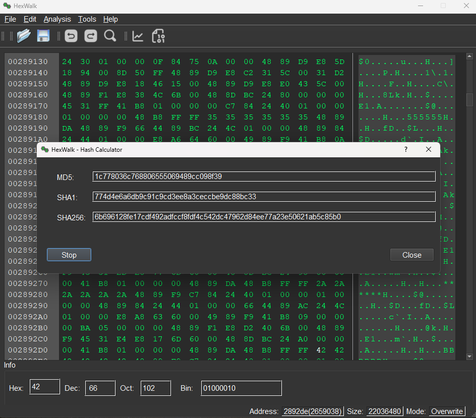
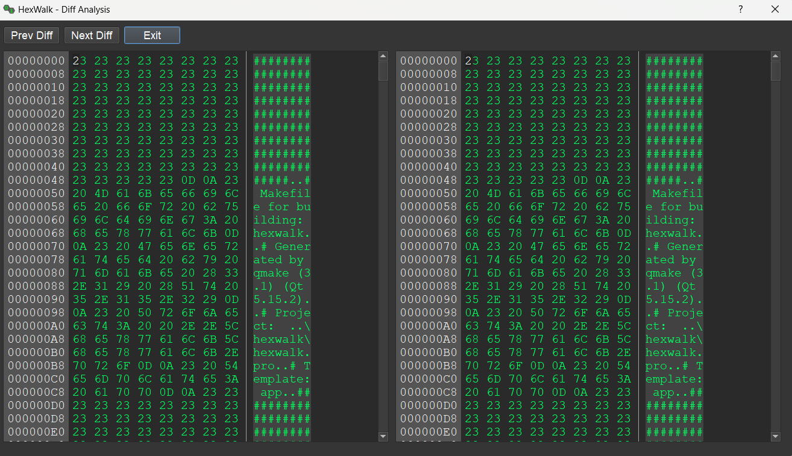
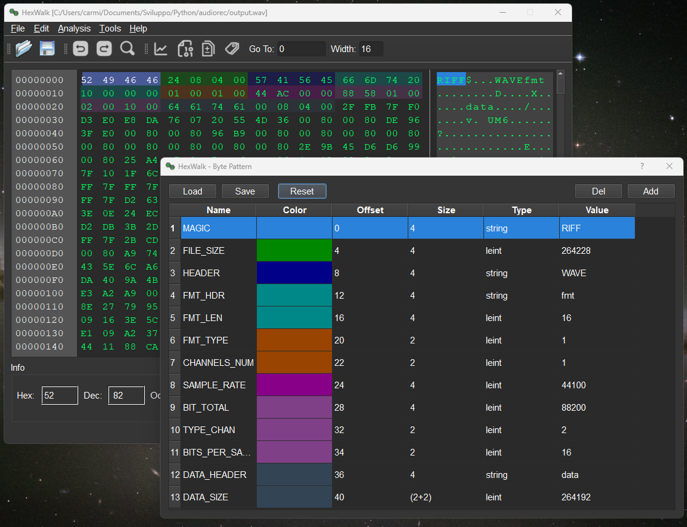

# HexWalk - Hex Editor/Viewer/Analyzer
 
HexWalk is an Hex editor, viewer, analyzer.

Based on opensource projects like qhexedit2,binwalk and QT.

It is cross platform and has plenty of features:

* Advanced Find (can find patterns in binary files based on HEX,UTF8,UTF16 and regex)
* Binwalk integration
* Entropy Analysis
* Byte Map
* Hash Calculator
* Bin/Dec/Hex Converter
* Hex file editing
* Diff file analysis
* Byte Patterns to parse headers
* Disassembler for x86,ARM and MIPS architectures


## Screenshots

* Main page


* Byte Map


* Advanced Search


* Entropy Calculator


* Binary Analyzer


* Hash Calculator


* Diff Analysis


* Binary Patterns for header parsing


## Usage

HexWalk release executables are self-contained, you can use as-is.
Binwalk functionalities need Binwalk to be installed on the OS. For Linux OS simply install binwalk with your package manager (eg. sudo apt install binwalk). On Mac install with "brew install binwalk" or from sources following the instructions on Binwalk repository.

For more details about the usage go to the Wiki:

https://github.com/gcarmix/hexwalk/wiki

## Windows 
HexWalk on Windows is released in different flavours:
 - as an installer
 - as a portable zip file

The fastest way to install it is through winget:

```
winget install hexwalk
```
## MacOS
On MacOS you can easily download the .dmg file available in the release page and drag the app in the Applications folder as usual


## Ubuntu
The project is also available on launchpad
https://launchpad.net/hexwalk
to install on Ubuntu you can simply do:
```
sudo add-apt-repository ppa:carmix/ppa

sudo apt update

sudo apt install hexwalk
```

## Linux
For other Linux distributions there's the AppImage file available in the release page. Just download, give execution permissions and you are ready to go.

## Build
If you want to build from source just open hexedit.pro in QT Creator and build it.
It is possible also to build from command line (linux_build.sh script provided).

## Acknowledgments

Thanks to these projects:

* Binwalk - https://github.com/ReFirmLabs/binwalk

* QHexEdit2 - https://github.com/Simsys/qhexedit2

* QT5

* Capstone - https://www.capstone-engine.org
