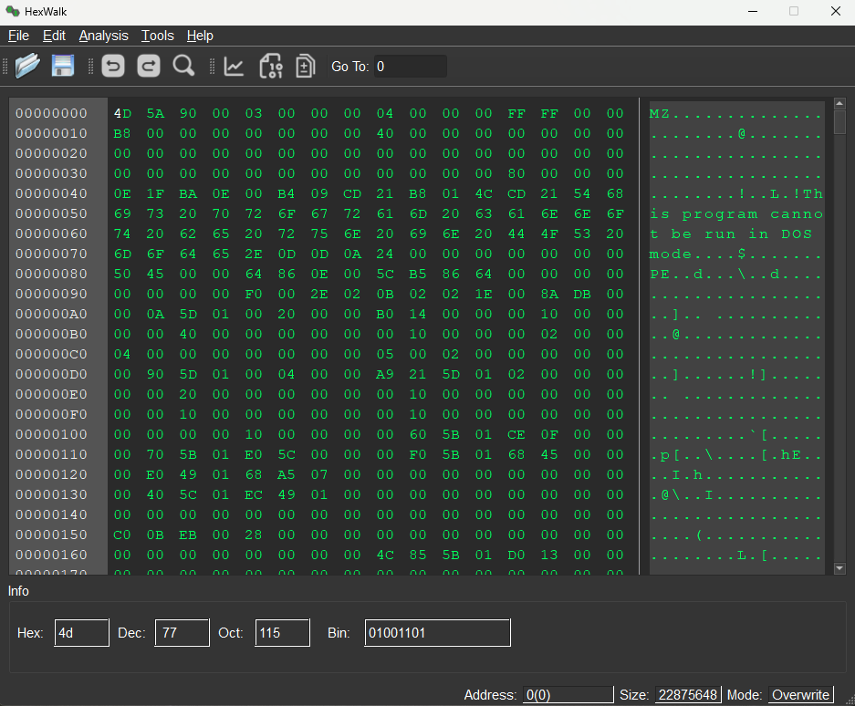
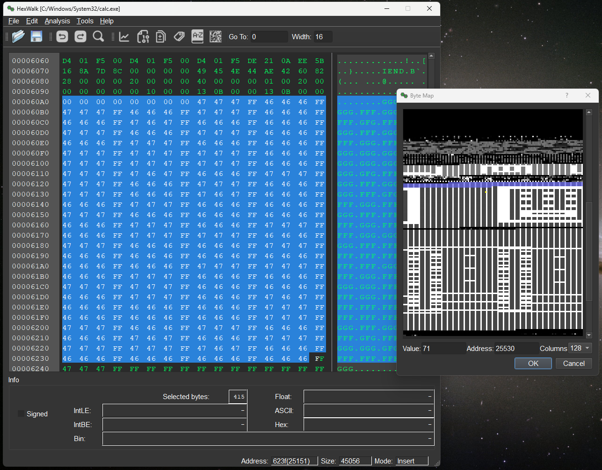
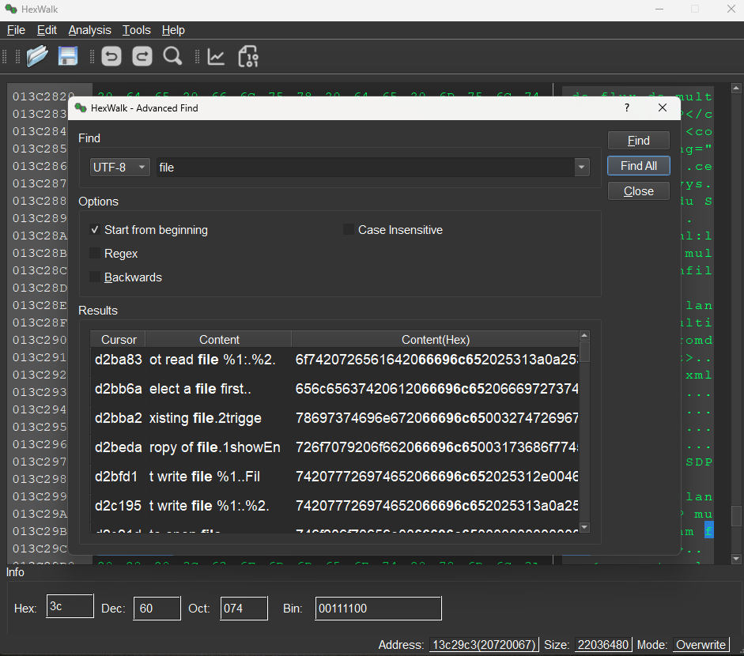
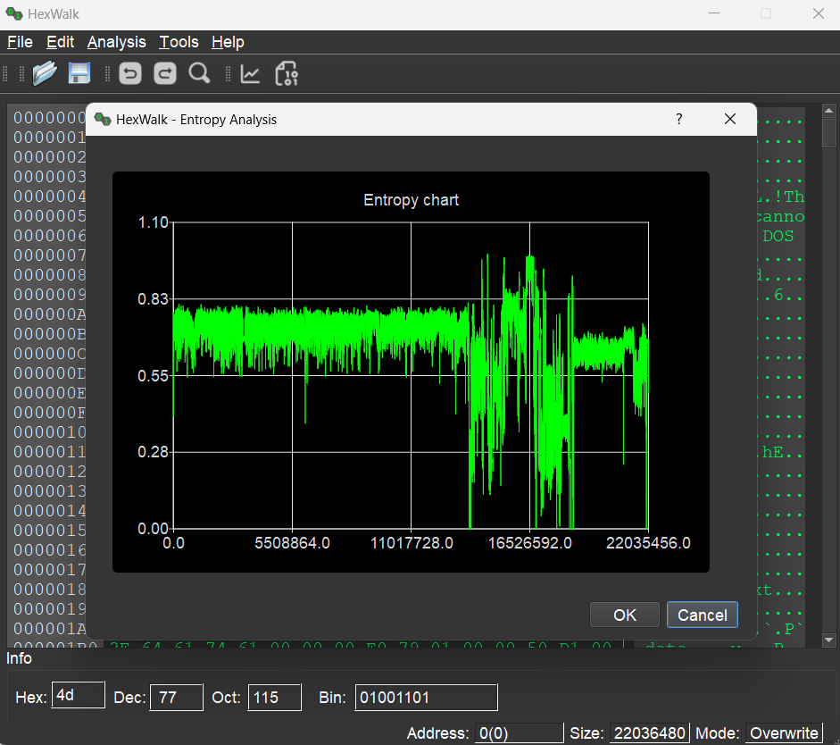
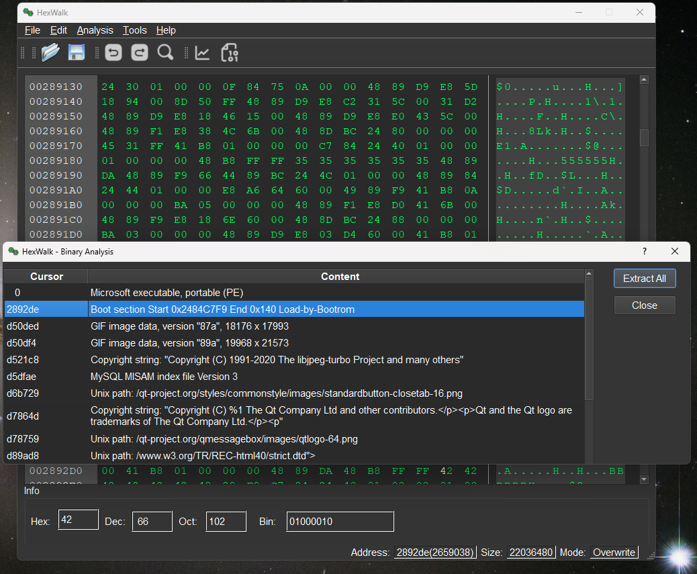
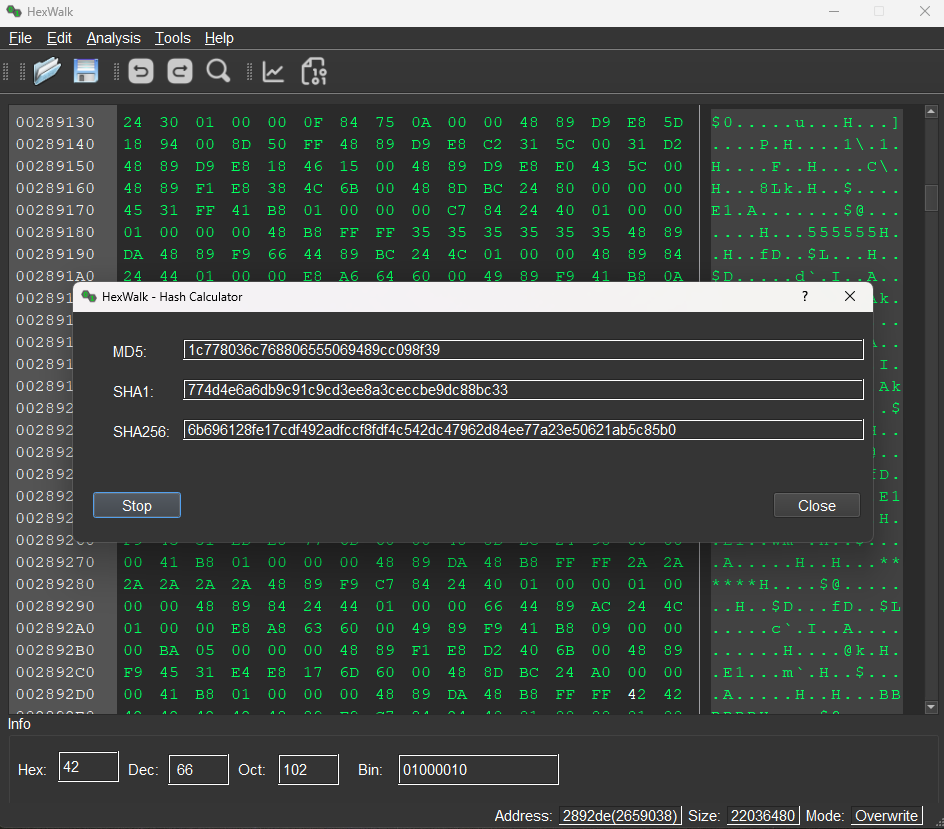
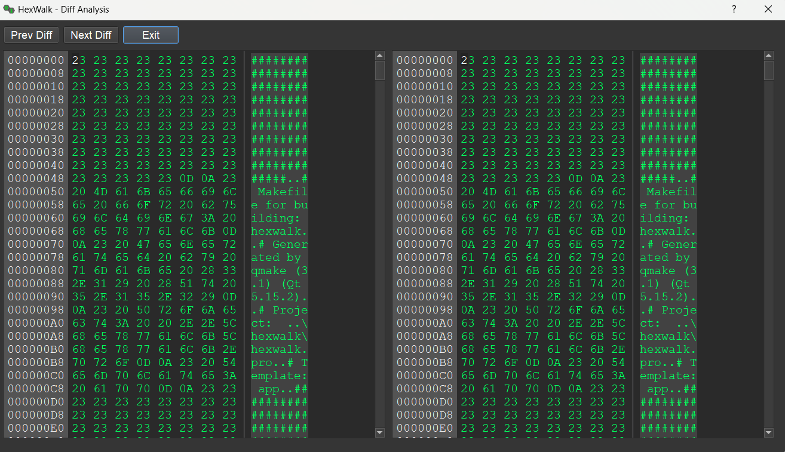
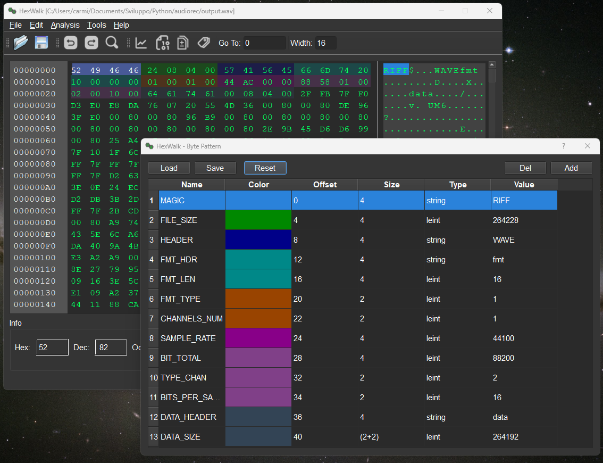

# HexWalk - Hex Editor/Viewer/Analyzer
 
HexWalk is an Hex editor, viewer, analyzer.

Built on qhexedit2, Capstone and Qt, with a built-in signature scanner,
[HexDig](https://www.github.com/gcarmix/hexdig), inspired by binwalk.

It is cross platform and has plenty of features:

* Advanced Find (can find patterns in binary files based on HEX,UTF8,UTF16 and regex)
* Binary signature scanner and extractor — pick HexDig (built-in, no setup) or Binwalk (external) from Options
* Entropy Analysis
* Byte Map
* Hash Calculator
* Bin/Dec/Hex Converter
* Hex file editing
* Diff file analysis
* Byte Patterns to parse headers
* Disassembler for x86,ARM and MIPS architectures


## Screenshots

* Main page


* Byte Map


* Advanced Search


* Entropy Calculator


* Binary Analyzer



* Hash Calculator


* Diff Analysis


* Binary Patterns for header parsing


## Usage

HexWalk release executables are self-contained, you can use as-is.

The binary analyzer can be backed by either of two engines, selectable in
**Options → Analyzer**:

* **HexDig** (default) — built in, no external dependency. Uses the `7z`
  tool when extracting archives (ZIP, 7Z, TAR, GZIP, …). On Linux install
  it with your package manager (`sudo apt install 7zip`, or
  `p7zip-full` on legacy systems). The Windows installer bundles it; the
  macOS build ships it inside the application bundle.
* **Binwalk** — invoked as an external command. Install it separately if
  you prefer it: `sudo apt install binwalk` on Linux,
  `brew install binwalk` on macOS, or from the upstream repository.

For more details about the usage go to the Wiki:

https://github.com/gcarmix/hexwalk/wiki

## Windows 
HexWalk on Windows is released in different flavours:
 - as an installer
 - as a portable zip file

The fastest way to install it is through winget:

```
winget install hexwalk
```
## MacOS
On MacOS you can easily download the .dmg file available in the release page and drag the app in the Applications folder as usual

## Debian
The project is now available on backports for Bookworm, just enable the backports repos by adding this line to /etc/apt/sources.list:
```
deb http://deb.debian.org/debian bookworm-backports main
```
and then type in:
```
sudo apt update

sudo apt install hexwalk
```

## Ubuntu
The project is also available on launchpad
https://launchpad.net/hexwalk
to install on Ubuntu you can simply do:
```
sudo add-apt-repository ppa:carmix/ppa

sudo apt update

sudo apt install hexwalk
```

## Linux
For other Linux distributions there's the AppImage file available in the release page. Just download, give execution permissions and you are ready to go.

The AppImage needs `libfuse2` (or `libfuse2t64` on Ubuntu 24.04+) on the
target machine to mount itself.

## Build
HexWalk uses CMake and requires Qt 6 (Core, Gui, Widgets, Charts).

```bash
cmake -B build -DCMAKE_BUILD_TYPE=Release
cmake --build build -j
```

Helper scripts at the repo root:

* `linux_build.sh` — one-shot Linux build
* [`build-appimage.sh`](build-appimage.sh) — produce a self-contained `HexWalk-*.AppImage` (uses linuxdeploy + the Qt plugin; downloads them on first run)
* [`build-deb.sh`](build-deb.sh) — produce a Debian source / binary package using the overlay under [`deb-packaging/hexwalk-2.0.0/debian/`](deb-packaging/hexwalk-2.0.0/debian/)

The `hexdig` CLI is also built as part of the project — see
[`hexdig/README.md`](hexdig/README.md) for standalone usage.

## Acknowledgments

Thanks to these projects:

* Binwalk - https://github.com/ReFirmLabs/binwalk (inspiration for the embedded HexDig scanner)

* QHexEdit2 - https://github.com/Simsys/qhexedit2

* Qt

* Capstone - https://www.capstone-engine.org
